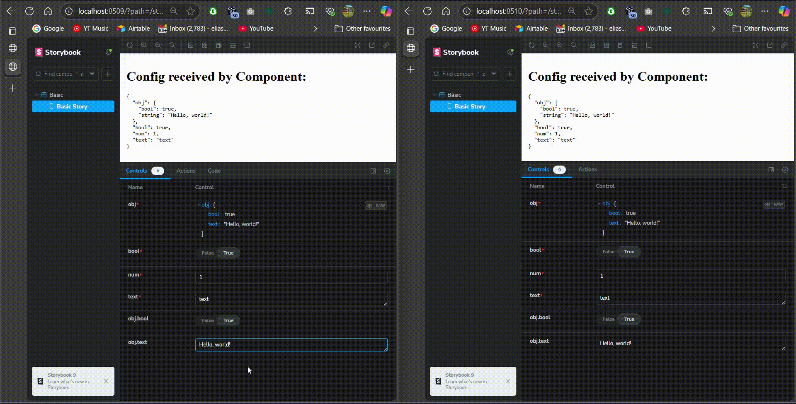

# Storybook Bug Reproduction

This repository is a minimal reproduction of a bug in Storybook that seems to have been introduced in version 8.5.0-beta.10 (see PR https://github.com/storybookjs/storybook/pull/30252).

See related Github issues:

- https://github.com/storybookjs/storybook/issues/31707
- https://github.com/eliasm307/storybook-addon-deep-controls/issues/48

# Bug Description

The bug seems to affect custom controls added via enhancers (ie argTypesEnhancers and argEnhancers) and causes changes from such controls to not be registered correctly in the UI, ie:

- Custom control changes do not trigger the "Unsaved changes" toolbar to appear
- Custom control changes revert to their initial values when user blurs the control input (but the actual values passed to the component are correctly updated)
- When a normal control is changed the "Unsaved changes" toolbar appears and also the custom control values are then updated in the UI, it seems updating these type of controls triggers the changes to be handled correctly.

The bug mainly seems to affect the controls panel UI where it does not update correctly when the control value changes, however the actual values passed to the component are correct.

This might potentially have been introduced by the changes in this commit https://github.com/storybookjs/storybook/commit/523f051861bea75f89ed425728cefce01e5aeec0 which changed how memoization works for panels, e.g. if the memoisation does not consider custom controls and values from enhancers correctly then it could lead to the UI not updating correctly.

NOTE: Also, custom control changes are not registered in the URL parameters of the story, but dont know if this is intentional as the controls are generated so maybe it makes sense not to register them in the URL.

This bug affects addons like [storybook-addon-deep-controls](https://www.npmjs.com/package/storybook-addon-deep-controls) which rely on enhancers. See issue https://github.com/eliasm307/storybook-addon-deep-controls/issues/48

# Repository Details

## Layout

This repository contains two main packages in the `/packages` directory:

- `8.5.0-beta.9_working`: This package is an example of a working Storybook setup.
- `8.5.0-beta.10_not_working`: This package is an example of a non-working Storybook setup that reproduces the bug.
- `8.6.14`: This package is an example of a working Storybook setup using the latest stable V8 version of Storybook (8.6.14) at the time.

All versions use the same stories defined in the `/stories` directory, and both define the same configuration in the respective `.storybook` directories.

## How to run example Storybooks

Run `yarn` to install dependencies.

NOTE: yarn is included in the repository so you do not need to install it separately
NOTE: The packages are setup to not hoist dependencies to the root, so the correct versions of Storybook dependencies are used in each package.

To launch the example storybooks run `yarn storybook:all` to start both versions of Storybook, then:

- The working version using Storybook 8.5.0-beta.9 can be accessed at `http://localhost:8509/`
- The non-working version using Storybook 8.5.0-beta.10 can be accessed at `http://localhost:8510/`
- The working version using Storybook 8.6.14 can be accessed at `http://localhost:8614/`

# Demo

Showing the behaviour difference between Storybook versions `8.5.0-beta.9` and `8.5.0-beta.10`.

NOTE: Storybook `8.6.14` has the same behaviour as `8.5.0-beta.10`.

